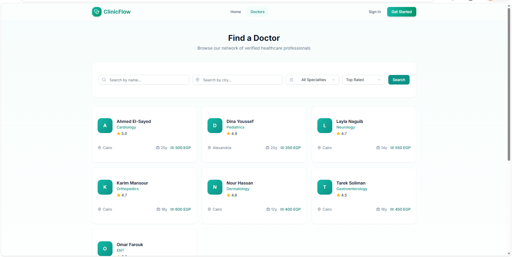
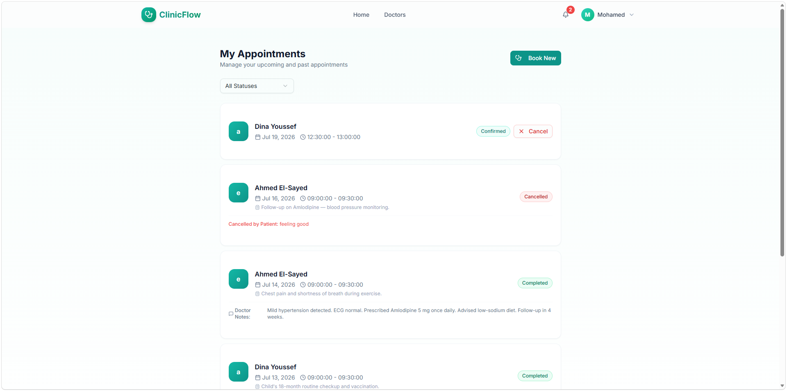
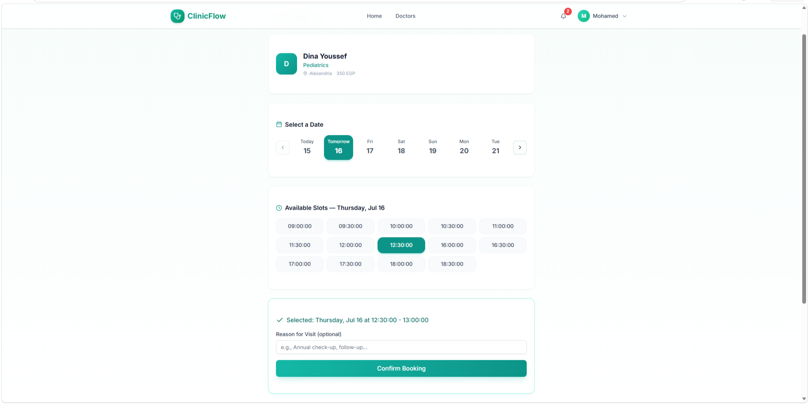
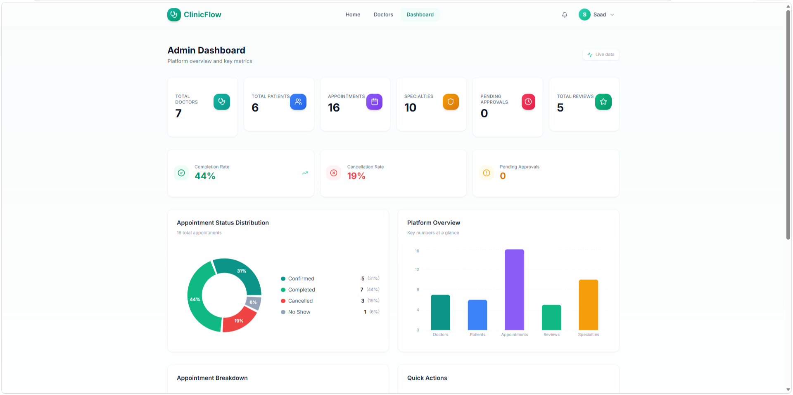
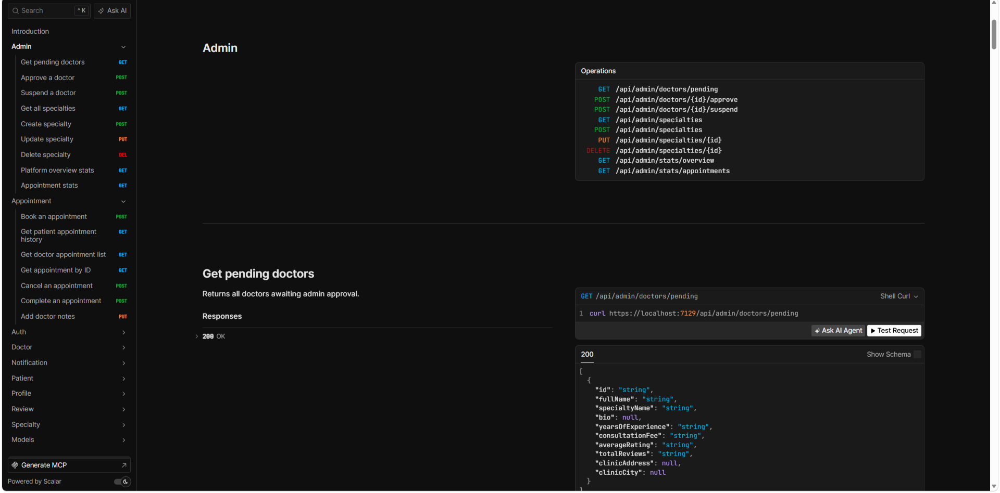

# 🏥 ClinicFlow

> Full-stack clinic management system — **.NET 10** REST API + **React/TypeScript** frontend, built with Clean Architecture.

ClinicFlow solves real clinic problems: doctors register and wait for admin approval before appearing in search, patients browse live slots and book appointments with optimistic concurrency preventing double-bookings under load, a background service sends automated reminders the day before, and JWT authentication uses refresh token rotation with theft detection.

**→ [Frontend Repository](https://github.com/S3d0o/ClinicFlow-Frontend) · [Live API Docs](https://registry.scalar.com/@default-team-2gu37/apis/clinicflow-v1@1.0.0) · [Live Demo on LinkedIn](https://www.linkedin.com/posts/saad-mohamed-li_dotnet-csharp-react-ugcPost-7483058574588379136-R35x/?utm_source=social_share_send&utm_medium=member_desktop_web&rcm=ACoAAFtidxABr0vs0HxJVu7Xnwvp_d1T8J8FNdM)** *(video walkthrough)*
---

## 📸 Screenshots

> **How to add screenshots:** Take these screenshots from your running frontend, save them in a `/docs/screenshots/` folder in the repo root, then they'll display here automatically.

### Doctor Search & Booking

*Browse doctors by specialty and city, view ratings and consultation fees*

### Patient Appointments

*View upcoming and past appointments, cancel or leave a review*


*Choosing a slot for a specific day marked as confirmed after booking*

### Admin Panel

*Approve pending doctors, view platform statistics*

### Scalar API Docs

*Interactive API documentation — [explore live](https://registry.scalar.com/@default-team-2gu37/apis/clinicflow-v1@1.0.0)*

> **Steps to add the images:**
> 1. Create a `docs/screenshots/` folder in your repo root
> 2. Take screenshots of: doctor search page, patient appointments page, doctor appointments page, admin panel, and `/scalar`
> 3. Save them with the exact filenames above
> 4. Commit and push — the images will render here on GitHub automatically

---

## ✨ What It Does

- **Role-based access** — three distinct roles (`Patient`, `Doctor`, `Admin`), each with their own endpoints and permissions
- **Doctor onboarding flow** — doctors register, submit their profile, and wait for admin approval before appearing in search results
- **Slot-based booking** — patients browse real-time available slots, book them, and cancel; optimistic concurrency (`RowVersion`) prevents double-bookings under load
- **Automated reminders** — a `BackgroundService` runs every hour, sends email + in-app notifications for next-day appointments, and stamps each record to prevent duplicate sends
- **Refresh token rotation** — 15-minute access tokens paired with 7-day rotating refresh tokens; replayed tokens trigger family-wide invalidation (theft detection)
- **Email integration** — confirmation, password reset, booking confirmation, and appointment reminders via SMTP (MailKit)
- **Result pattern** — all service methods return `Result<T>` instead of throwing exceptions, giving consistent and predictable error propagation across the entire stack
- **Structured logging** — Serilog with Console, rolling File, and Seq sinks; every request enriched with TraceId, path, method, and client IP
- **Interactive API docs** — Scalar UI available at `/scalar` in development
- **Docker support** — multi-stage `Dockerfile` included for containerized deployment

---

## 🏛️ Architecture

Clean Architecture with six projects and a strict one-way dependency flow:

```
ClinicFlow.sln
├── Domain                  # Entities, interfaces, enums, domain parameters
├── Shared                  # DTOs, error types, Result pattern, settings
├── Persistance             # EF Core DbContext, configurations, migrations, repositories, UoW
├── Services.Abstraction    # Service contracts (interfaces only)
├── Services                # Business logic, AutoMapper profiles, email service
├── Presentation            # Controllers, FluentValidation, API filters
└── ClinicFlow              # Entry point — DI wiring, middleware, background jobs
```

**Dependency flow:**

```
ClinicFlow → Presentation → Services.Abstraction
                          → Services → Persistance → Domain
                                    ↘ Shared ↗
```

---

## 🛠️ Tech Stack

### Backend

| Layer | Technology |
|---|---|
| Runtime | .NET 10 |
| Web framework | ASP.NET Core 10 |
| ORM | Entity Framework Core 10 |
| Database | SQL Server |
| Authentication | ASP.NET Core Identity + JWT Bearer |
| Mapping | AutoMapper 16 |
| Validation | FluentValidation 12 |
| Email | MailKit 4 |
| Logging | Serilog (Console · File · Seq) |
| API docs | Scalar + ASP.NET Core OpenAPI |
| Containerization | Docker (multi-stage) |

### Frontend

| Layer | Technology |
|---|---|
| Framework | React 19 + TypeScript |
| Routing | React Router v7 |
| Styling | Tailwind CSS + shadcn/ui |
| Animations | Framer Motion |
| HTTP client | Axios |
| Date handling | date-fns |

---

## 📁 Domain Model

```
ApplicationUser (Identity)
├── DoctorProfile           ← specialty, fee, rating, clinic info, admin approval flag
│   ├── DoctorSchedule      ← recurring weekly template (day + time range)
│   ├── AppointmentSlot     ← materialized slots with RowVersion for concurrency
│   ├── Appointment         ← booking record; links Patient ↔ Slot ↔ Doctor
│   └── Review              ← one per completed appointment; updates doctor avg rating
└── PatientProfile          ← blood type, medical history, emergency contact

Notification                ← per-user inbox (booked / reminder / cancelled)
RefreshToken                ← hashed, IP-tracked, rotation-aware
```

---

## 🔌 API Overview

| Endpoint | Role | What |
|---|---|---|
| `POST /api/auth/*` | Public | Register, login, refresh token, email confirm, forgot/reset password |
| `GET /api/doctors` | Public | Paginated doctor search — filter by specialty and city, sort by rating/fee/experience |
| `GET /api/doctors/{id}/slots` | Public | Available slots for a doctor on a given date |
| `GET /api/specialties` | Public | List all medical specialties |
| `POST /api/appointments` | Patient | Book an available slot |
| `DELETE /api/appointments/{id}` | Patient / Doctor | Cancel an appointment |
| `PATCH /api/appointments/{id}/complete` | Doctor | Mark a past appointment as completed |
| `PATCH /api/appointments/{id}/notes` | Doctor | Add or update clinical notes |
| `GET /api/appointments` | Patient / Doctor | View own appointments with status filter and pagination |
| `POST /api/doctors/schedule` | Doctor | Create weekly schedule — slots generated automatically |
| `PUT /api/doctors/schedule/{id}` | Doctor | Update an existing schedule |
| `POST /api/reviews` | Patient | Submit a review for a completed appointment |
| `GET /api/reviews` | Public | List reviews for a doctor |
| `GET /api/notifications/my` | Authenticated | Fetch notifications, optionally filter unread |
| `PATCH /api/notifications/{id}/read` | Authenticated | Mark a notification as read |
| `GET /api/profile/me` | Authenticated | Get own profile |
| `GET /api/admin/doctors/pending` | Admin | List doctors awaiting approval |
| `POST /api/admin/doctors/{id}/approve` | Admin | Approve a doctor |
| `GET /api/admin/overview` | Admin | Platform stats — total users, appointments, revenue |

> Full interactive docs available at `/scalar` when running in Development mode.

---

## 🚀 Getting Started

### Prerequisites

- [.NET 10 SDK](https://dotnet.microsoft.com/download)
- SQL Server (local or remote)
- (Optional) [Seq](https://datalust.co/seq) for structured log viewing

### 1. Clone the repository

```bash
git clone https://github.com/S3d0o/ClinicFlow.git
cd ClinicFlow
```

### 2. Configure settings

Update `ClinicFlow/appsettings.json`:

```json
{
  "ConnectionStrings": {
    "DefaultConnection": "Server=.;Database=ClinicFlow;Trusted_Connection=True;"
  },
  "JwtSettings": {
    "Secret": "<your-256-bit-secret>",
    "Issuer": "https://localhost:5143",
    "Audience": "ClinicFlowClient",
    "AccessTokenExpirationMinutes": 15,
    "RefreshTokenExpirationDays": 7
  },
  "EmailSettings": {
    "Host": "smtp.gmail.com",
    "Port": 587,
    "Username": "<your-email>",
    "Password": "<your-app-password>",
    "FromName": "ClinicFlow",
    "FromAddress": "<your-email>"
  }
}
```

> **Security:** Never commit real credentials. Use [user secrets](https://learn.microsoft.com/en-us/aspnet/core/security/app-secrets) or environment variables in production.

```bash
dotnet user-secrets set "JwtSettings:Secret" "<your-secret>" --project ClinicFlow/ClinicFlow.csproj
```

### 3. Apply migrations

```bash
dotnet ef database update --project Persistance --startup-project ClinicFlow
```

The app runs `DataSeeder.SeedAsync` on startup and populates roles, specialties, doctors, patients, appointments, reviews, and notifications automatically.

### 4. Run the API

```bash
dotnet run --project ClinicFlow/ClinicFlow.csproj
```

Navigate to `https://localhost:5143/scalar` to explore all endpoints interactively.

---

### 🔑 Seeded Accounts

| Role | Email | Password |
|---|---|---|
| Admin | admin@clinicflow.com | Admin@1234 |
| Doctor — Cardiology | ahmed.elsayed@clinicflow.com | Doctor@1234 |
| Doctor — Dermatology | nour.hassan@clinicflow.com | Doctor@1234 |
| Doctor — Orthopedics | karim.mansour@clinicflow.com | Doctor@1234 |
| Doctor — Pediatrics | dina.youssef@clinicflow.com | Doctor@1234 |
| Doctor — Gastroenterology | tarek.soliman@clinicflow.com | Doctor@1234 |
| Doctor — Neurology | layla.naguib@clinicflow.com | Doctor@1234 |
| Doctor — ENT (pending approval) | omar.farouk@clinicflow.com | Doctor@1234 |
| Patient | mohamed.ali@gmail.com | Patient@1234 |
| Patient | sara.ibrahim@gmail.com | Patient@1234 |
| Patient | hassan.mahmoud@gmail.com | Patient@1234 |
| Patient | rana.khalil@gmail.com | Patient@1234 |
| Patient | youssef.badawi@gmail.com | Patient@1234 |

---

## 🐳 Docker

```bash
# Build from solution root
docker build -f ClinicFlow/Dockerfile -t clinicflow .

# Run with your connection string
docker run -p 8080:8080 \
  -e "ConnectionStrings__DefaultConnection=Server=host.docker.internal;Database=ClinicFlow;..." \
  clinicflow
```

---

## 🔐 Authentication Flow

```
POST /api/auth/register/patient   → confirmation email sent
POST /api/auth/confirm-email      → account activated
POST /api/auth/login              → { accessToken (15 min), refreshToken (7 days) }
POST /api/auth/refresh-token      → new token pair issued; old refresh token invalidated
Authorization: Bearer <accessToken>
```

Refresh tokens are hashed before storage. If a previously used token is replayed within the theft detection window (5 min default), the entire token family is invalidated immediately.

---

## ⚙️ Background Jobs

**`AppointmentReminderJob`** — runs every hour via `PeriodicTimer`:

1. Queries appointments scheduled for tomorrow with no reminder sent yet
2. Creates an in-app `Notification` for the patient
3. Sends an email reminder via MailKit
4. Stamps `ReminderSentAt` on the appointment to prevent duplicate sends

---

## 📐 Design Patterns

| Pattern | Where used |
|---|---|
| Clean Architecture | Solution structure — strict one-way dependency flow |
| Repository + Unit of Work | `IUnitOfWork` aggregates all repos; one `SaveChangesAsync` per request |
| Result pattern | `Result<T>` across all service returns — no exception-driven control flow |
| Optimistic concurrency | `RowVersion` on `AppointmentSlot` prevents double-booking races |
| Options pattern | `JwtSettings`, `EmailSettings` bound via `IOptions<T>` |
| Background Service | `IHostedService` for the appointment reminder job |

---

## 🗺️ Roadmap

- [ ] WebSocket / SignalR for real-time notifications
- [ ] Redis caching for doctor search results and slot availability
- [ ] Admin dashboard UI
- [ ] Google Calendar integration for appointment sync
- [ ] Mobile app (React Native)

---

## 📂 Project Structure

```
ClinicFlow-master/
├── ClinicFlow/                         # Entry point
│   ├── BackgroundJobs/
│   │   └── AppointmentReminderJob.cs
│   ├── Extensions/
│   │   ├── InfraStructureServiceExtensions.cs
│   │   └── WebApiExtensions.cs
│   ├── Program.cs
│   └── Dockerfile
├── Domain/
│   ├── Entities/
│   │   ├── AppModule/                  # Appointment, Slot, Doctor/Patient profile, Review, Specialty
│   │   └── IdentityModule/             # ApplicationUser, RefreshToken, Notification
│   ├── Enums/
│   ├── Interfaces/
│   │   ├── IRepositories/
│   │   └── IUnitOfWork.cs
│   └── Parameters/
├── Persistance/
│   ├── AppData/
│   │   ├── Configurations/
│   │   ├── Migrations/
│   │   ├── ClinicDbContext.cs
│   │   └── DataSeeder.cs
│   └── Repositories/
├── Services.Abstraction/
│   └── Contracts/                      # IAuthService, IAppointmentService, IDoctorService ...
├── Services/
│   ├── Implementations/                # AuthService, AppointmentService, TokenService, EmailService ...
│   └── MappingProfiles/
├── Presentation/
│   └── Controllers/                    # Auth, Appointment, Doctor, Patient, Admin, Review ...
└── Shared/
    ├── DTOs/                           # Request / Response models per domain
    ├── Errors/                         # Typed error constants per domain
    ├── ResultPattern/                  # Result<T>, Error, ErrorType
    └── Settings/                       # JwtSettings, EmailSettings
```

---

## 👤 Author

**Saad Mohamed**

- GitHub: [@S3d0o](https://github.com/S3d0o)
- LinkedIn: [linkedin.com/in/saad-mohamed-li](https://linkedin.com/in/saad-mohamed-li)

---

## 📄 License

This project is open source and available under the [MIT License](LICENSE).
